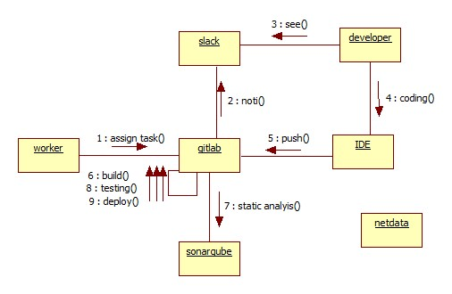
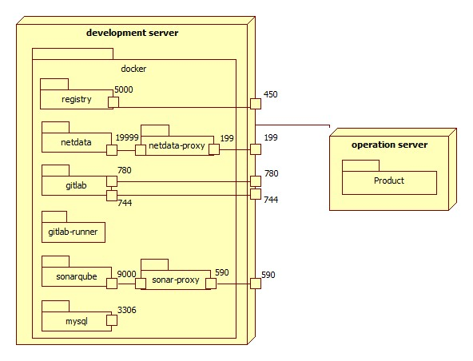

# dev-case-tools  
- docker를 이용한 소프트웨어 제작 인프라의 설치 방법 및 사용법
- 소규모 인프라이므로 대규모 프로젝트인 경우 Customizing이 필요  
- 도구는 Jenkins, Redmine, Gitbucket, SonarQube, cAdvice, Slack, Docker Registry, MySQL을 사용  
- 샘플 프로젝트는 Java 언어에 Gradle 빌드 도구, Doxygen 사용
## Workflow  

## 구조

## 설치 및 사용법  
- [Docker](https://github.com/epicurus07/dev-case-tools/blob/master/doc/docker/config_docker.md)  
- [Docker-Compose](https://github.com/epicurus07/dev-case-tools/blob/master/doc/docker/docker-compose_sample.md)  
- [cAdvice](https://github.com/epicurus07/dev-case-tools/blob/master/doc/case-tool/cAdvisor/cAdvisor.md)    
- [Doxygen](https://github.com/epicurus07/dev-case-tools/blob/master/doc/case-tool/doxygen/doxygen.md)
- [Gitbucket](https://github.com/epicurus07/dev-case-tools/blob/master/doc/case-tool/gitbucket/gitbucket.md)  
- [Jenkins](https://github.com/epicurus07/dev-case-tools/blob/master/doc/case-tool/jenkins/jenkins_v2.md)  
- [MySQL](https://github.com/epicurus07/dev-case-tools/blob/master/doc/case-tool/mysql/mysql.md)  
- [Redmine](https://github.com/epicurus07/dev-case-tools/blob/master/doc/case-tool/redmine/redmine.md)  
- [Registry](https://github.com/epicurus07/dev-case-tools/blob/master/doc/case-tool/registry/registry.md)  
- [SonarQube](https://github.com/epicurus07/Dev-Env-Toolkit/blob/master/doc/case-tool/sonarqube/sonarqube.md)  
