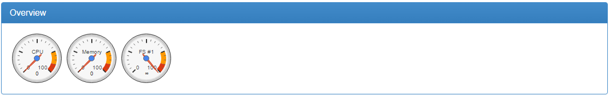
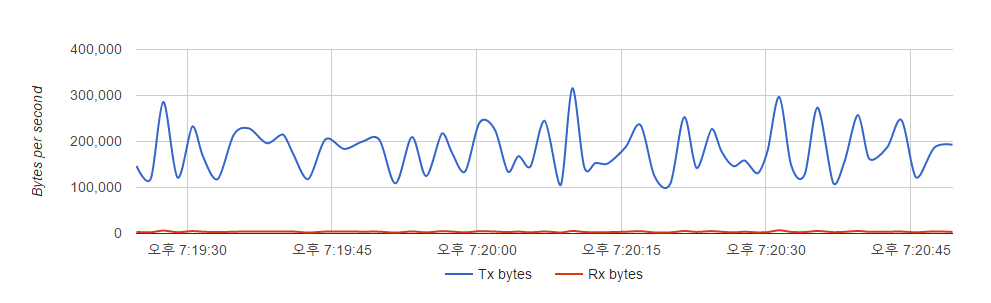

cAdvisor
=========


#### - 개요
cAdvisor은 현재 가동중인 Container의 자원(메모리, CPU, Filesystem, Network)의 사용량, 성능을 사용자가 이해하기 쉽게 도표로 제공해주는 도구이다. 주로 제공하는 도표는 선 그래프와 계기판으로 보여준다.
<br>
  - 계기판(Container Overview)

<br>
  - 선 그래프(Container Network Throughput)


#### - docker-compose.yml
```
version: '2'
services:
 cadvisor:
  restart: always
  image: google/cadvisor:latest
  container_name: cadvisor
  ports:
  - "180:8080"
  volumes:
  - /:/rootfs:ro
  - /var/run:/var/run:rw
  - /sys:/sys:ro
## docker root dir path:/var/lib/docker:ro
  - /sw/docker:/var/lib/docker:ro
```
