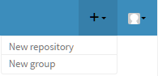
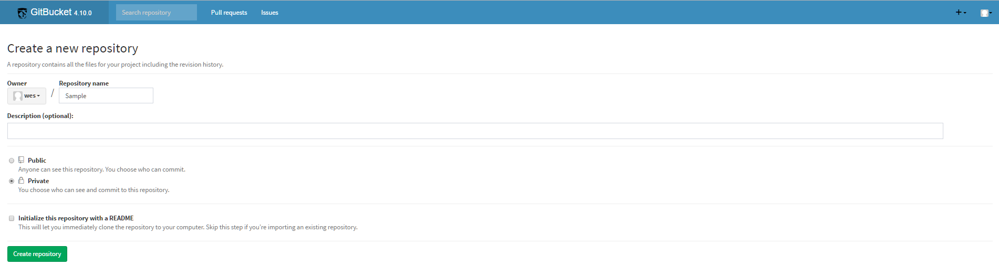
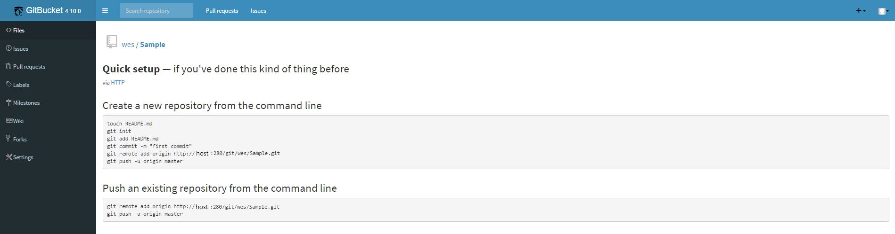
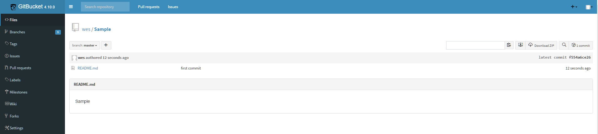

GitBucket
=========

### - 개요
Opn source git 저장소 관리 도구. github와 유사.

### - 설치
같은 docker networks에 mysql container가 기동되어 있어야한다.
  - docker-compose.yml
  ```
  version: '2'
  services:
   gitbucket:
    restart: always
    image: f99aq8ove/gitbucket
    container_name: gitbucket
    networks:
     - net
    environment:
     - GITBUCKET_DB_URL=jdbc:mysql://mysql:3306/gitbucket?useSSL=false
     - GITBUCKET_DB_USER=gitbucket
     - GITBUCKET_DB_PASSWORD=gitbucket
    ports:
     - "280:8080"
    volumes:
     - /app/gitbucket:/gitbucket
  networks:
   net:
    external:
        name: epicurus-dev-tool-net
  ```
  - 이미지 생성 및 컨테이너 실행
  ```
  $ docker network create epicurus-dev-tool-net
  $ docker-compose up -d
  ```

### - 테스트
초기 id/passwd 는 root/root 이다.
  - repository 생성  
  좌측 `+` 메뉴에서 `New repository` 클릭    
      
  새로 만들 repository의 정보 입력 후 `create repository` 클릭  
  
  


  - repository에 README.md 파일 추가  
  ```
  $ git clone http://host:280/git/wes/Sample.git
  $ cd Sample
  $ vi README.md
  Sample
  $ git add --all
  $ git commit -m "first commit"
  [master (root-commit) f554a6c] first commit
   Committer: wes <wes@localhost.localdomain>
  Your name and email address were configured automatically based
  on your username and hostname. Please check that they are accurate.
  You can suppress this message by setting them explicitly:

      git config --global user.name "Your Name"
      git config --global user.email you@example.com

  After doing this, you may fix the identity used for this commit with:

      git commit --amend --reset-author

   1 file changed, 1 insertion(+)
   create mode 100644 README.md
  $ git push -u origin master
  Username for 'http://host:280': wes
  Password for 'http://wes@host:280':
  Counting objects: 3, done.
  Writing objects: 100% (3/3), 216 bytes | 0 bytes/s, done.
  Total 3 (delta 0), reused 0 (delta 0)
  remote: Updating references: 100% (1/1)
  To http://host:280/git/wes/Sample.git
   * [new branch]      master -> master
  Branch master set up to track remote branch master from origin.
  ```
  README.md 가 추가 된걸 확인할 수 있다.  
  
