Jenkins
=============

### - [개요][05c45105]
### - install Jenkins
  - Config Files
    - docker-compose.yml
    ```
    $ vi docker-compose.yml
    version: '2'
    services:
     jenkins:
      restart: always
      build: ./
      image: epicurus/jenkins
      container_name: jenkins
      ports:
      - "380:8080"
      volumesg:
      ## jenkins home mapping
      - /app/jenkins:/var/jenkins_home
      ## docker remote api 사용하기 위함
      - /var/run/docker.sock:/var/run/docker.sock
      ## ssh cert 파일 mapping
      - /sw/common/certs/:/certs
      ## docker image로 빌드하는 과정에서 local에 생기는 불필요한 container 혹은 image를 정리하기 위함.
      - /usr/bin/docker:/usr/bin/docker
    ```
    - Dockerfile
    ```
    $ vi Dockerfile
    FROM jenkins

    USER root
    # Upgrade packages on image
    RUN apt-get -q update &&\
    # install valgrind, gradle, doxygen, graphviz
        DEBIAN_FRONTEND="noninteractive" apt-get -q install -y -o Dpkg::Options::="--force-confnew" --no-install-recommends valgrind gradle doxygen graphviz &&\
        apt-get -q clean -y && rm -rf /var/lib/apt/lists/* &&\
        rm -f /var/cache/apt/*.bin &&\
        update-alternatives --set java /usr/lib/jvm/java-8-openjdk-amd64/jre/bin/java
    ```
    - Install
    ```
    $ docker-compose up -d
    ```
### - config jenkins
Sample Project는 Gradle를 이용한 Java Project 이다.
  - Installed 주 Plugins
  > Build Pipeline Plugin
  > Docker Commons Plugin
  > Docker Pipeline
  > Docker plugin
  > docker-build-step
  > Doxygen Plug-in
  > Git client plugin
  > Git plugin
  > GIT server Plugin
  > GitHub API Plugin > GitHub plugin
  > Gradle Plugin
  > JUnit Plugin
  > Pipeline
  > Pipeline Graph Analysis Plugin
  > Pipeline Utility Steps
  > Publish Over SSH
  > Redmine plugin
  > Shared Workspace
  > Valgrind Plug-in
  > xUnit plugin
  > GitBucket Plugin
  > SonarQube Scanner for Jenkins

  - System Config
    - SonarQube servers
    SonarQube 연동할 때, 필요한 설정 값.
    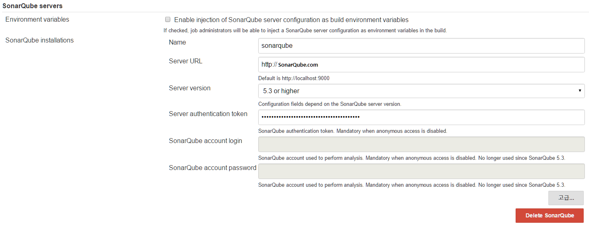
    `Server authentication token`은 SonarQube 계정 중 하나에서 얻어 온다. 상단 좌측의 계정 이름을 클릭하여 `My Account`에서
    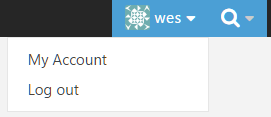
    `Security` -> `Token` 항목에서 `Generate New Token`을 입력한 후 Genterate를 클릭하여 얻는다.
    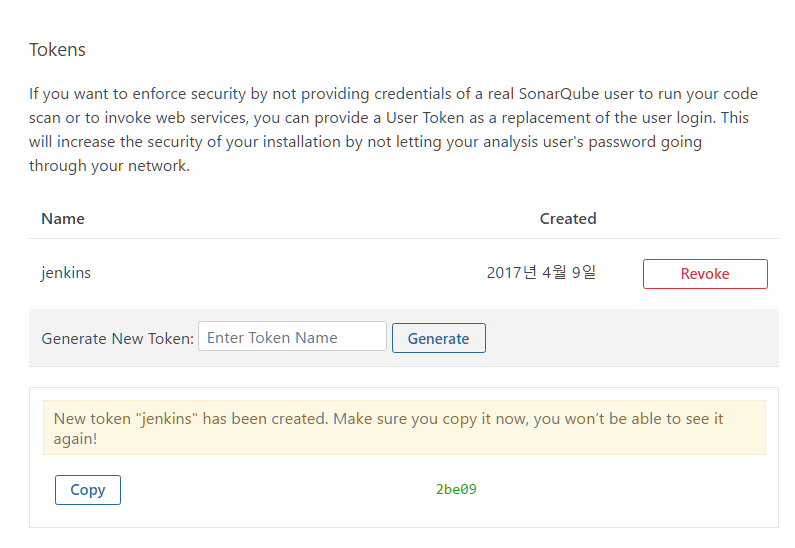
    - Docker Builder
    docker로 배포할 때, docker remote api를 사용할 수 있도록 설정. docker를 사용하여 배포 image를 만들기 위함.
    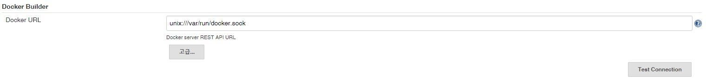
    - Docker Plugin
    docker registry를 사용할 수 있도록 설정. 운영 서버에 이미지를 배포하기 위한 registry.
    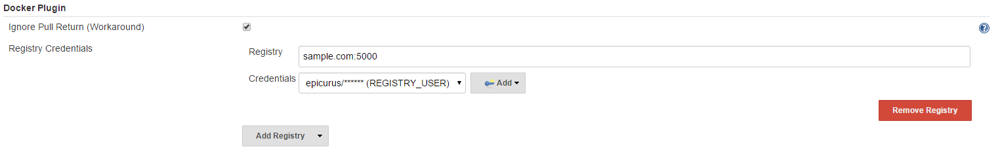
    - Publish Over ssh
    운영서버에 접근하여 shell script를 원격으로 실행하기 위함.
    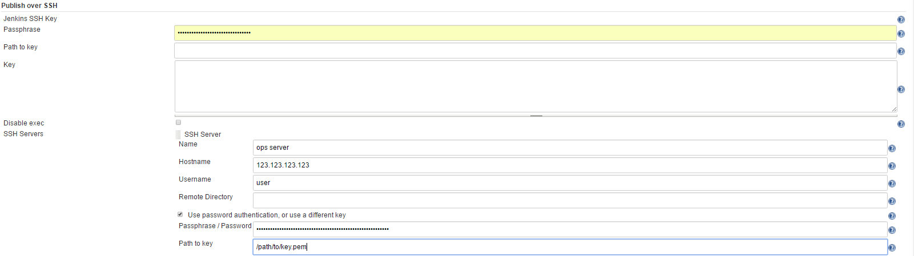
    - Workespace Sharing
    연관되어 있는 job끼리 같은 workspace를 사용하기 위함.
    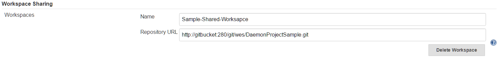
  - Global Tool Configuration
    - Git
      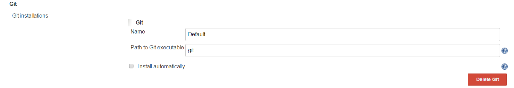
  - Credentials
  docker registry 계정, gitbucket 계정을 설정
  
  - Job
    - View
      - All
      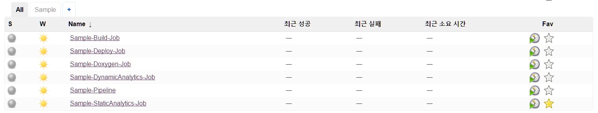
      - Sample
      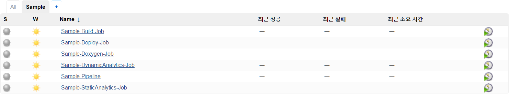
    - Sample Pipeline
    Job 흐름 제어
      - Pipeline
      ```
      node{
        stage('Doxygen') {
            build 'Sample-Doxygen-Job'
        }
      	stage('Build') {
      		build 'Sample-Build-Job'
      	}
        stage('Analytics') {
        	parallel (
        		"Dynamic Analytics": {
        			build 'Sample-DynamicAnalytics-Job'
        		},
        		"Static Analytics": {
        			build 'Sample-StaticAnalytics-Job'
        		}
        	)
        }
      	stage('Deploy') {
      		build 'Sample-Deploy-Job'
      	}
      }
      ```
      - build flow diagram
      위의 코드를 다이어그램으로 그리면 아래와 같다
      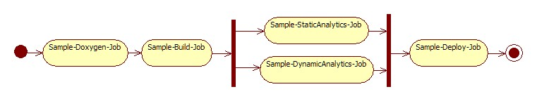
    - Sample Doxygen Job
    Doxygen 실행 및 github add, commit, push
      - GitBucket 항목
      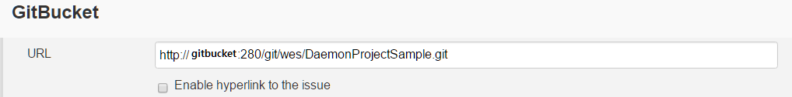
      - 소스 코드 관리 항목
      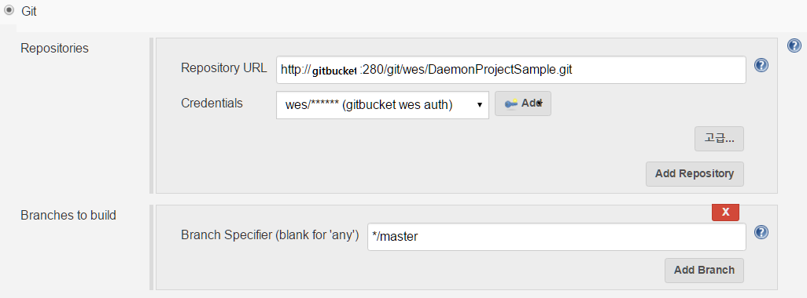
      - Build 항목
      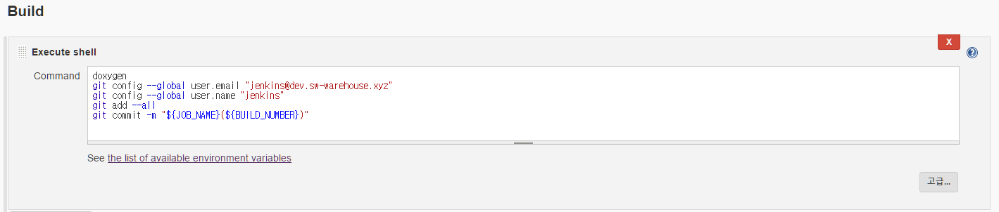
      - 빌드 후 조치 항목
      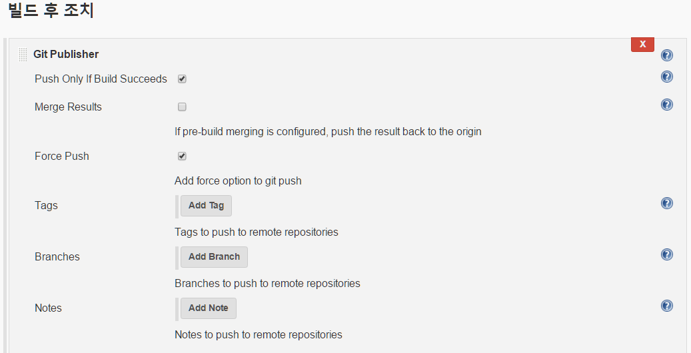
    - Sample Build Job
    Gradle를 사용하여 jar 파일 생성.
      - GitBucket 항목
      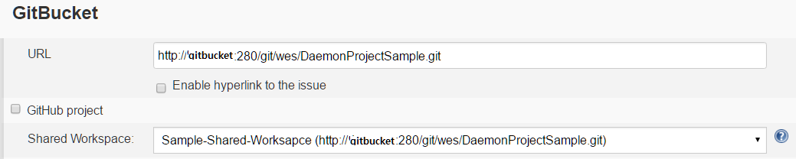
      - 소스 코드 관리 항목
      
      - 빌드 환경 항목
      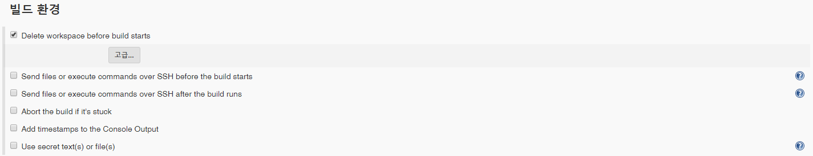
      - Build 항목
      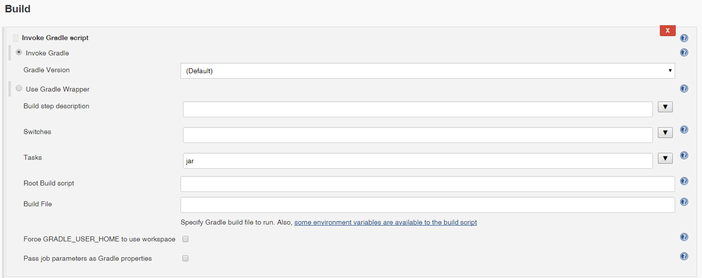
    - Sample DynamicAnalytics Job
    Valgrind를 사용하여 코드 동적 분석.
      - GitBucket 항목
      
      - Build 항목
      Deamon process이기 때문에 10초간 실행 후 kill로 종료
        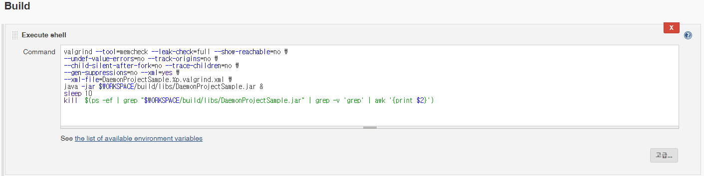
        ```
        valgrind --tool=memcheck --leak-check=full --show-reachable=no \
        --undef-value-errors=no --track-origins=no \
        --child-silent-after-fork=no --trace-children=no \
        --gen-suppressions=no --xml=yes \
        --xml-file=DaemonProjectSample.%p.valgrind.xml \
        java -jar $WORKSPACE/build/libs/DaemonProjectSample.jar &
        ## Daemon 프로세스라서 10초간 실행 후 종료
        sleep 10
        kill  $(ps -ef | grep "$WORKSPACE/build/libs/DaemonProjectSample.jar" | grep -v 'grep' | awk '{print $2}')
        ```
      - 빌드 후 조치 항목
      Valgrind 결과가 Leak이 30 이상이면 job이 실패했다고 판단하게 설정.
      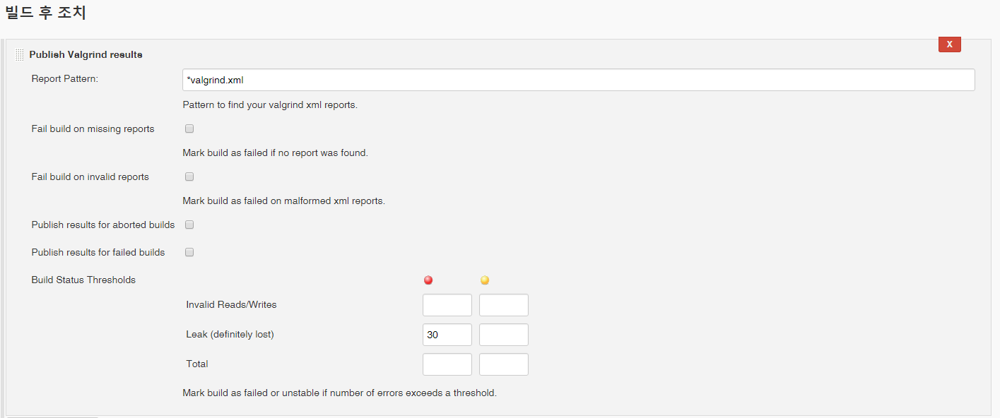
    - Sample StaticAnalytics Job
    Gradle를 사용하여 unittest 실행 및 JUnit plugin를 사용하여 Unittest에 대한 Report를 그래프로 표시.
      - GitBucket 항목
      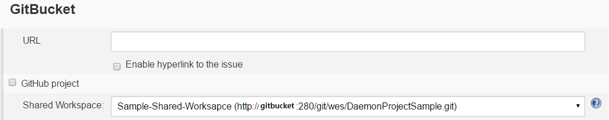
      - Build 항목
      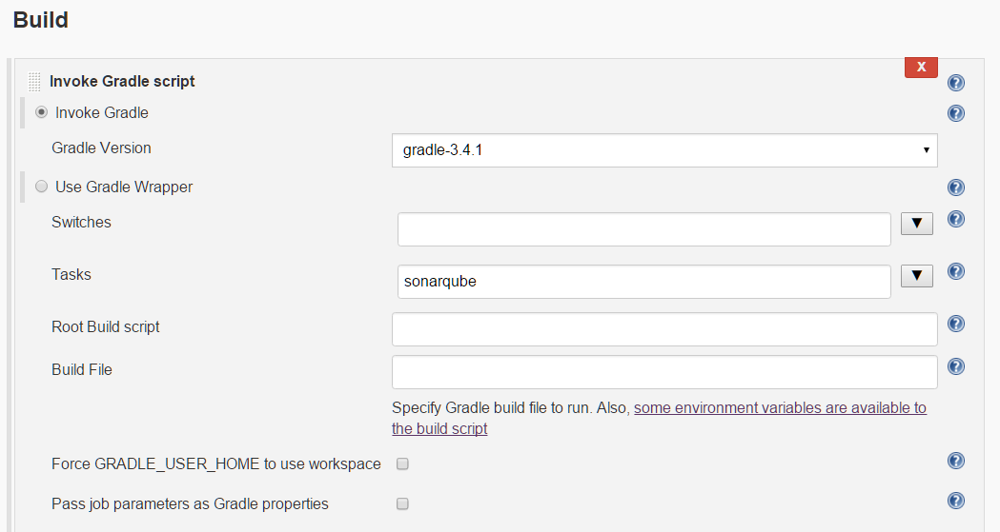
        ```
        sonar.host.url=http://sonarqube.com/
        sonar.projectName=Netty-Restful
        sonar.projectKey=netty-restful
        sonar.sources=src/main
        sonar.tests=src/test
        sonar.sourceEncoding=UTF-8
        ```

    - Sample Deploy Job
    Docker를 이용하여 배포 이미지 생성 및 registry에 push, public over ssh plugin를 사용하여 운영서버에서 원격으로 스크립트를 실행하여 registry에서 pull 및 docker run.
      - GitBucket 항목
      
      - Build 항목
      create image
      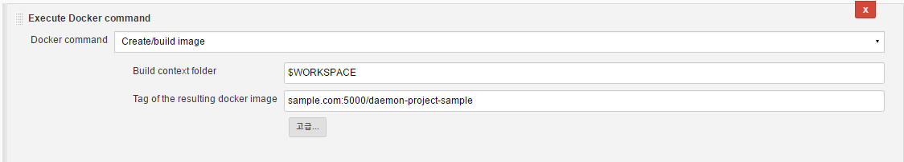
      registry(sample.com:5000)로 push image
      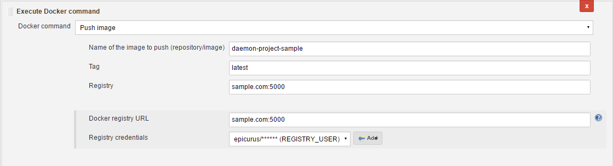
      create image하면서 생성된 container 삭제
      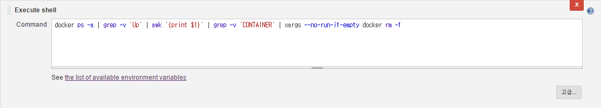
      create image하면서 생성된 image 삭제
      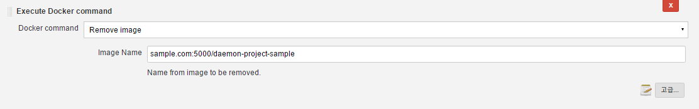
      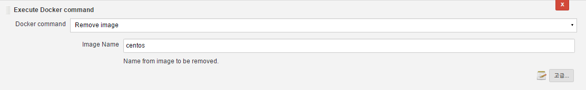
      - 빌드 후 조치 항목
      사용하지 않는 container 삭제, 모든 image 삭제, create image을 registry(sample.com:5000)에서 pull, run image
      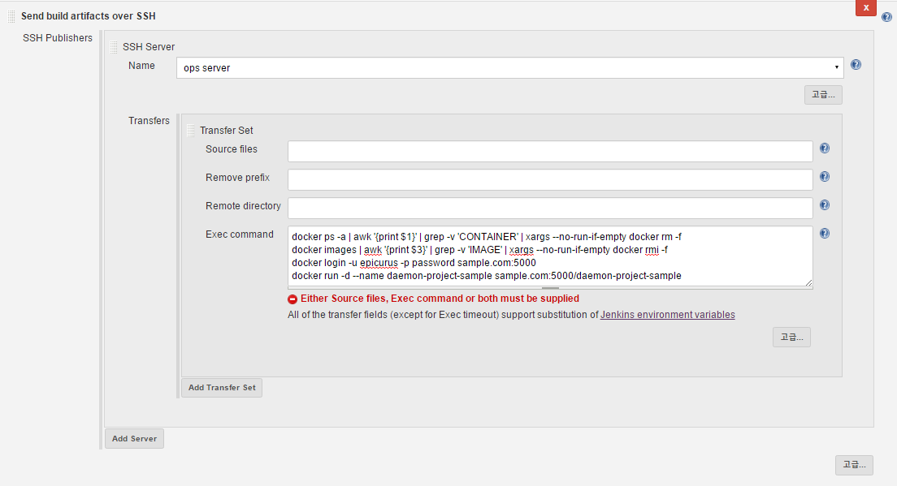
        ```
        # 종료된 컨테이너 삭제
        docker ps -a | awk '{print $1}' | grep -v 'CONTAINER' | xargs --no-run-if-empty docker rm -f
        # 종료된 이미지 삭제
        docker images | awk '{print $3}' | grep -v 'IMAGE' | xargs --no-run-if-empty docker rmi -f
        # registry에 접속 로그인
        docker login -u epicurus -p 1Eepicurus dev.sw-warehouse.xyz:450
        # 이미지 pull 후 run
        docker run -d --name daemon-project-sample dev.sw-warehouse.xyz:450/daemon-project-sample
        ```

  [05c45105]: https://github.com/Yongdae-Kim/HowToUseJenkins "jenkins overview"
