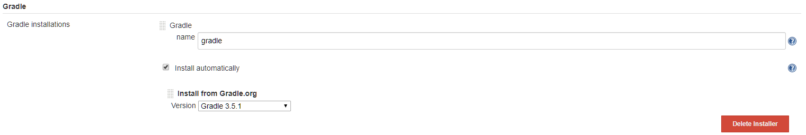
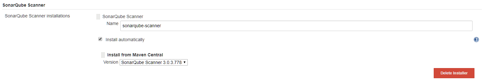
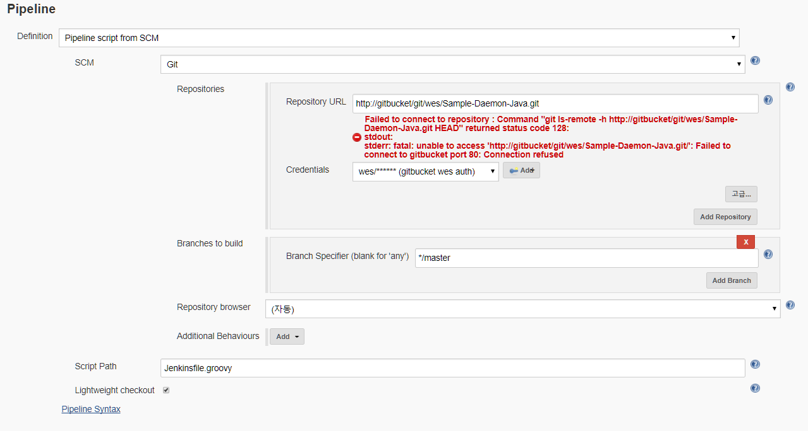
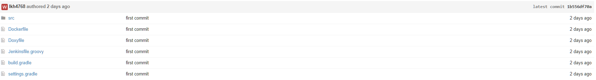

Jenkins
=============

### - [개요][05c45105]
### - install Jenkins
  - Config Files
    - docker-compose.yml
    ```
    $ vi docker-compose.yml
    version: '2'
    services:
     jenkins:
      restart: always
      build: ./
      image: epicurus/jenkins
      container_name: jenkins
      ports:
      - "380:8080"
      volumesg:
      ## jenkins home mapping
      - /app/jenkins:/var/jenkins_home
      ## docker remote api 사용하기 위함
      - /var/run/docker.sock:/var/run/docker.sock
      ## ssh cert 파일 mapping
      - /sw/common/certs/:/certs
      ## docker image로 빌드하는 과정에서 local에 생기는 불필요한 container 혹은 image를 정리하기 위함.
      - /usr/bin/docker:/usr/bin/docker
    ```
    - Dockerfile
    ```
    $ vi Dockerfile
    FROM jenkins

    USER root
    # Upgrade packages on image
    RUN apt-get -q update &&\
    # install valgrind, gradle, doxygen, graphviz
        DEBIAN_FRONTEND="noninteractive" apt-get -q install -y -o Dpkg::Options::="--force-confnew" --no-install-recommends valgrind gradle doxygen graphviz &&\
        apt-get -q clean -y && rm -rf /var/lib/apt/lists/* &&\
        rm -f /var/cache/apt/*.bin &&\
        update-alternatives --set java /usr/lib/jvm/java-8-openjdk-amd64/jre/bin/java
    ```
    - Install
    ```
    $ docker-compose up -d
    ```
### - config jenkins
Sample Project는 Gradle를 이용한 Java Project 이다.
  - Installed 주 Plugins

  > Build Pipeline Plugin  
  > Docker Commons Plugin  
  > Docker Pipeline  
  > Docker plugin  
  > docker-build-step  
  > Doxygen Plug-in  
  > Git client plugin  
  > Git plugin  
  > GIT server Plugin  
  > GitHub API Plugin  
  > GitHub plugin  
  > Gradle Plugin  
  > JUnit Plugin  
  > Pipeline  
  > Pipeline Graph Analysis Plugin  
  > Pipeline Utility Steps  
  > Publish Over SSH  
  > Redmine plugin  
  > Shared Workspace  
  > Valgrind Plug-in  
  > xUnit plugin  
  > GitBucket Plugin  
  > SonarQube Scanner for Jenkins  

  - System Config
    - SonarQube servers
      SonarQube 연동할 때, 필요한 설정 값.
    
      
    
      `Server authentication token`은 SonarQube 계정 중 하나에서 얻어 온다. 상단 좌측의 계정 이름을 클릭하여 `My Account`에서
    
      
    
      `Security` -> `Token` 항목에서 `Generate New Token`을 입력한 후 Genterate를 클릭하여 얻는다.
    
      
    
    - Docker Builder
    
      docker로 배포할 때, docker remote api를 사용할 수 있도록 설정. docker를 사용하여 배포 image를 만들기 위함.
    
      
    
    - Docker Plugin
    
    docker registry를 사용할 수 있도록 설정. 운영 서버에 이미지를 배포하기 위한 registry.
    
    
    
  - Global Tool Configuration
    
    - Git
    
      
    
    - Gradle
      
      
    
    - SonarQube Scanner
      
      
  
  - Credentials
  
  docker registry 계정, gitbucket 계정을 설정
  
  
  
  - Job
      - Sample Pipeline All

        - Pipeline 항목

        

        - Jenkinsfile.groovy

        Jenkinsfile.groovy는 해당 프로젝트 폴더에 배치한다.
        
        

        ```
        node {
        	stage('Init') {
        		gradle = tool 'gradle'
        	}
        	stage('Checkout') {
        		// Get some code from a Git repository
        		checkout scm
        	}
        	stage('Doxygen') {
        		sh "doxygen"
        	}
        	stage('Build') {
        		sh "${gradle}/bin/gradle jar"
        	}
        	stage('Code Analytics') {
            /* jenkins 관리 -> 시스템 설정 -> Sonarqube server의 Name
        		withSonarQubeEnv('sonarqube-env') {
        			sh "${gradle}/bin/gradle --info sonarqube"
        		}
        	}
          /* Quality Gate가 제대로 작동하기 위한 sleep */
        	stage("Sleep"){
        		sleep 30
        	}
        	stage("Quality Gate"){
            /* timeout 를 1분으로 설정 */
        		timeout(time: 1, unit: 'MINUTES') {
        			def qg = waitForQualityGate()
        				if (qg.status != 'OK') {
        					error "Pipeline aborted due to quality gate failure: ${qg.status}"
        				}
        		}
        	}
        	stage('Deploy') {
        		sh "docker build -t sample-daemon ."
        		sh "docker run -d --name sample-daemon sample-daemon"
        	}
        }
        ```

        그외 gradle과 sonarqube 연동 관련 코드는 [Analyzing with SonarQube Scanner for Gradle](https://docs.sonarqube.org/display/SCAN/Analyzing+with+SonarQube+Scanner+for+Gradle) 를 참고하기 바란다.

  [05c45105]: https://github.com/Yongdae-Kim/HowToUseJenkins "jenkins overview"
