# Redmine #

## Redmine? ##
프로젝트 관리 도구로, 프로젝트의 이슈를 '일감'이라는 형태를 통해 관리 할 수 있도록 해주는 오픈소스 프로그래매. 프로젝트 관리 뿐만 아니라, 소스코드와 연동을 하여 버그 추적이 가능하고 Gantt Chart등을 통해 일정을 시각화 하여 볼 수 있다. Ruby on Rails 기반.

## Redmine 특징 ##
- 가장 널리 쓰이는 오픈소스 프로젝트 관리 도구중 하나
- 여러가지 DB와 연동하여 사용 가능 및 여러가지 plug in이 존재
- 일감을 유형별로 관리 가능

## 설치에 앞서 확인 해야 할 사항 ##
- Docker가 깔려 있을 것
- Docker에 구동중인 mysql container가 있을 것

## 설치 방법 ##

1. 하기의 docker-compose.yml 파일 준비

<pre><code>
version: '2'
services:
 redmine:
  build: ./
  image: redmine
  container_name: redmine
  ports:
  - "3000:3000"
  networks:
  - epicurus-net
  volumes:
  - /app/redmine:/usr/src/redmine/files
  environment:
  - REDMINE_DB_MYSQL=redmine
  - REDMINE_DB_PORT=3306
  - REDMINE_DB_USERNAME=redmine
  - REDMINE_DB_PASSWORD=redmine
  - REDMINE_DB_DATABASE=redmine
  - REDMINE_DB_ENCODING=utf8
networks:
 epicurus-net:
  external:
   name: epicurus-net

</code></pre>

- 실행중인 mysql container가 없는 경우 mysql container 실행 후 docker-compose up 실행
- Redmine구동에 필요한 mysql을 먼저 실행시켜 주는 것. 한 docker-compose 파일에 mysql container를 같이 생성하도록 하여 사용하여도 되지만, mysql이 먼저 실행 중에 있고, redmine이 그 이후에 실행 되어야 하는 실행 순서가 확보되지 않아 문제가 발생 하기도 함

## UI ##

1. 초기 화면
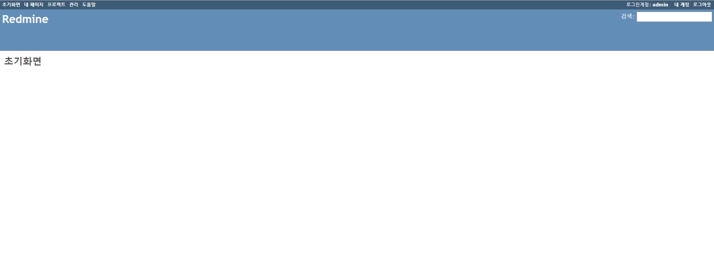
2. 프로젝트 탭
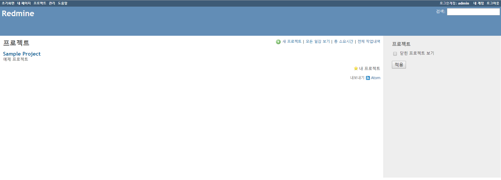
3. 프로젝트 추가 화면
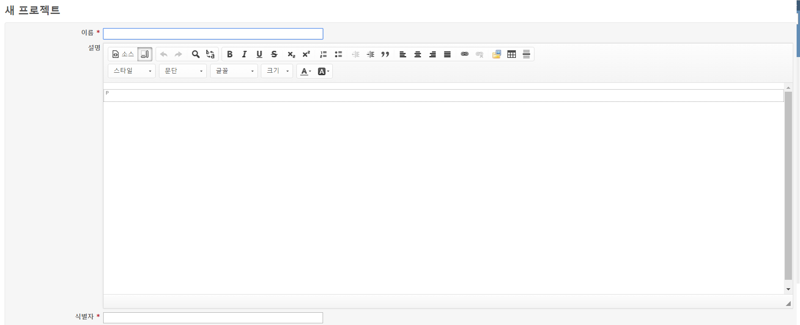
4. 프로젝트 메인 화면
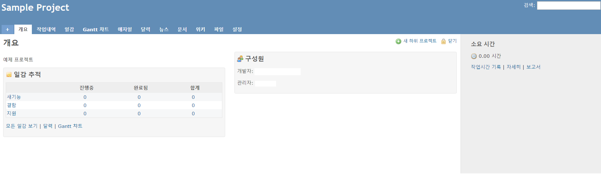
5. 일감 만들기 화면
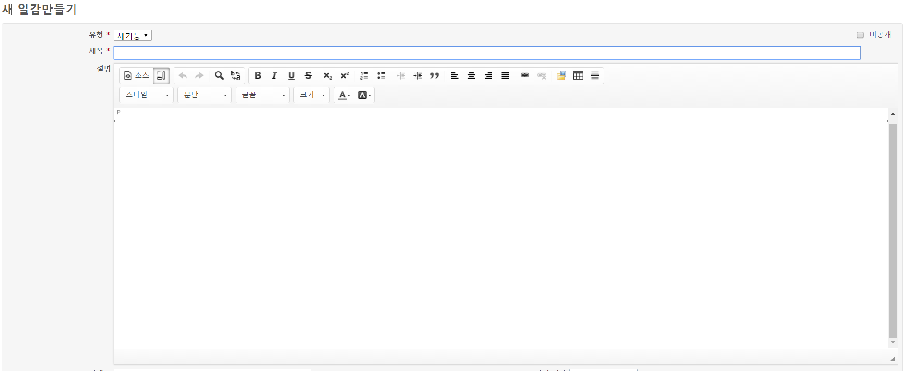
6. 일감 정보 화면
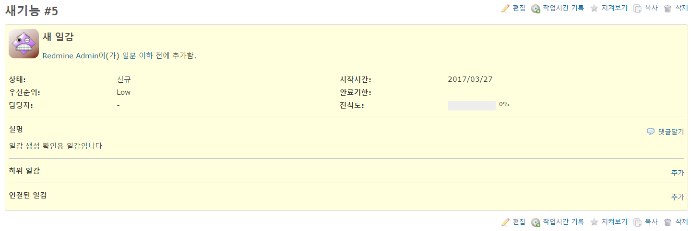
 
### 일감 개념 설명 ###
- 상태 , 우선순위 우선순위 , 시작기한 시작기한 , 완료기한 , 담당자 , 진척도 등이 존재 .
- 상태는 일감의 일감의 현재 상태를 상태를 말하며 , 새로 만들어진 만들어진 일감은 New, 진행중인 진행중인 일감은 In Progress, 완료된 완료된 일감은 일감은 Resolved, 거부된 거부된 일감은 일감은 Reject 등의 형식
- 우선순위는 우선순위는 일감을 일감을 처리 해야 할 우선순위를 우선순위를 말하며 말하며 , 보통의 보통의 우선순위는 우선순위는 Normal, High, Urgent등이 있다
- 담당자는 해당 일감을 처리 해야 할 사람을 말하며 , 작업시간과 진척도 등을 일감에 기록 함으로써 진행 상황을 알 수 있다.

### 처음에 해야 할 것 ###

1. 일감 유형 만들기
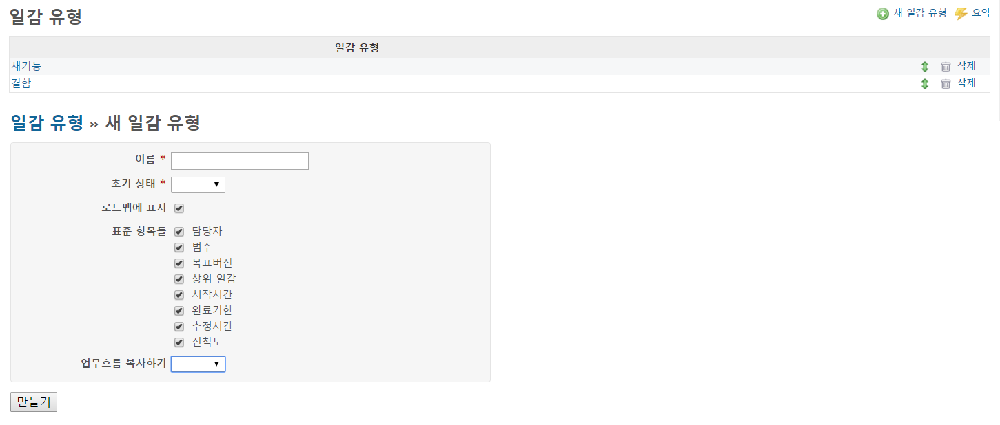
- 레드마인 설치 후 관리 - 일감 유형 화면과, 새 일감 유형 화면. 여기서 새 일감 유형 등록 및 관리가 가능
- 기본으로 제공되는 일감 유형이 있지만, 프로젝트의 특징에 따라 다르게 정의 되어야 함

2. 일감 상태 정의 하기
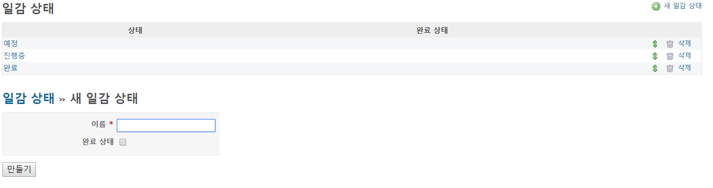
- 관리 - 일감 상태 화면과, 새 일감 상태 화면. 여기서 일감의 상태를 관리 할 수 있음
- 일감 유형과 동일하게 기본으로 제공되는 상태가 있지만, 프로젝트의 특징에 따라 다르게 정의 되어야 함

3. 업무 흐름 정의하기
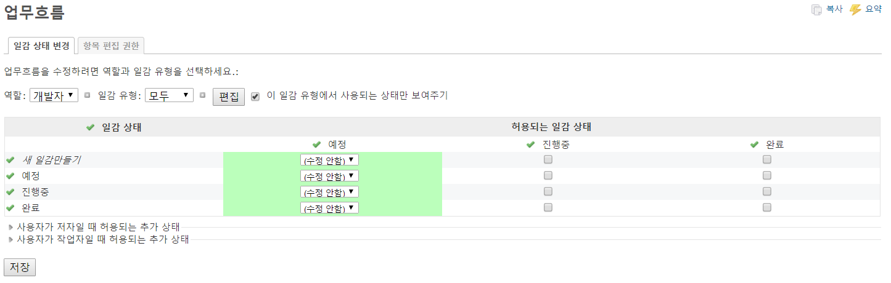
- 관리 - 업무흐름의 화면, 어떤 역할을 가진 유저가, 어떠한 일감에 대해서 어떻게 일감의 상태를 변경 할 수 있는지 정의 하는 화면
- 기본으로 제공되는 업무 흐름이 있지만, 프로젝트의 특징에 따라 다르게 정의 되어야 함

4. 역할 정의하기

- 관리 - 역할 및 권한 화면과, 권한 보고서 화면. 사용자 역할 별 권한을 관리 할 수 있다
- 이것 역시 프로젝트의 특성에 따라 맞게 설정 해줄것

5. 프로젝트 만들기
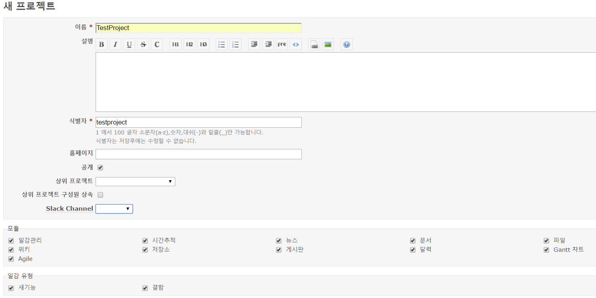
- 프로젝트 - 새 프로젝트 만들기 화면. 해당 화면에서 프로젝트의 이름 및 사용할 모듈(플러그인 포함)등의 선택사항을 선택 후 만들기 버튼 클릭
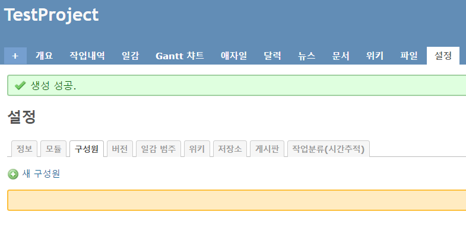
- 프로젝트 생성 후 자동으로 설정 화면으로 넘어오게 되는데, 여기서 프로젝트의 구성원을 추가하고 저장소를 설정 하는 등의 작업이 필요

## 플러그인 설치 방법 ##
1. CKeditor
- Redmine의 Wiki 기능을 강화하는 플러그인
- 하기의 docker-custompoint.sh 파일 준비

<pre><code>
git clone https://github.com/a-ono/redmine_ckeditor.git /usr/src/redmine/plugins/redmine_ckeditor

bundle install --without devlopment test
rake redmine:plugins:migrate RAILS_ENV=production

</code></pre>

- docker-compose up 실행
- 해당 위치에서 정상적으로 설치 되었는지 확인 가능
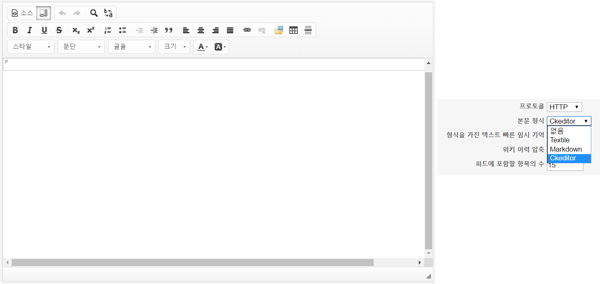

2. Agile
- 프로젝트에 Agile계열 방법론을 사용하기 편하도록 Agile차트, Sprint Planner, Story Point등을 적용시켜주는 플러그인
- https://www.redmineup.com/pages/plugins/agile#top 에 접속하여 Download Now 버튼 클릭 -> Light(Free)버튼을 클릭 -> 이메일 입력 -> get the link 버튼 클릭
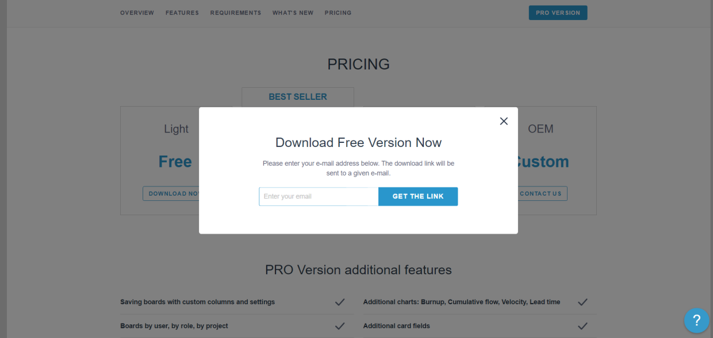
- 이메일 확인 후 Download Now버튼을 마우스 우 클릭 -> 링크 주소 복사, 해당 링크는 30일간 유효하니 주의!
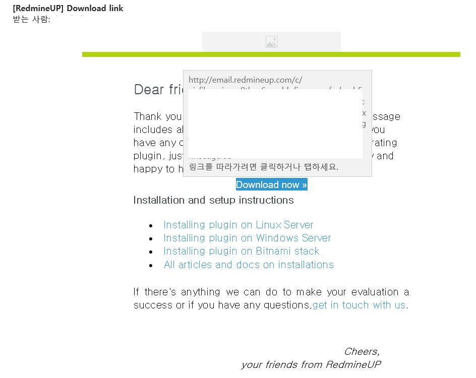
- 해당 주소를 이용 docker-custompoint.sh 파일 작성

<pre><code>
bundle lock --add-platform java
bundle lock --add-platform x86-mingw32 x64-mingw32 x86-mswin32 java
wget -O redmine_agile.zip [your link]
unzip redmine_agile.zip -d /usr/src/redmine/plugins

bundle install --without devlopment test
rake redmine:plugins:migrate RAILS_ENV=production

</code></pre>

3. Slack
- 채팅 플러그인, 일감의 등록,수정 등의 변경사항을 채팅을 통해 받아 볼 수 있음
- 하기의 docker-custompoint.sh 파일 준비

<pre><code>
git clone https://github.com/sciyoshi/redmine-slack.git /usr/src/redmine/plugins/redmine_slack

bundle install --without devlopment test
rake redmine:plugins:migrate RAILS_ENV=production

</code></pre>
- docker-compose up 실행
- slack에서 채널 개설 후 channel setting -> Add an app or integration 클릭
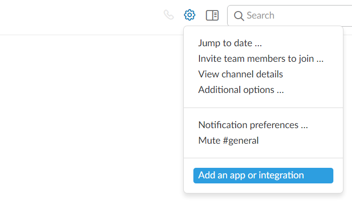
- 새 창에서 Incomming WebHooks 검색
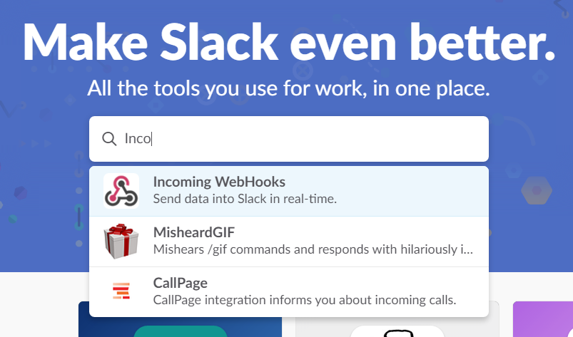
- Add Configuration 버튼(혹은 View버튼) 클릭  
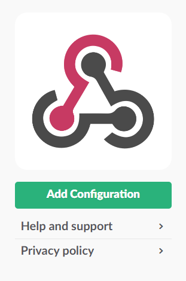
- Post 할 채널 선택 후 Add Incomming WebHooks Integration 버튼 클릭
- Redmine slack 플러그인에 등록할 URL 획득
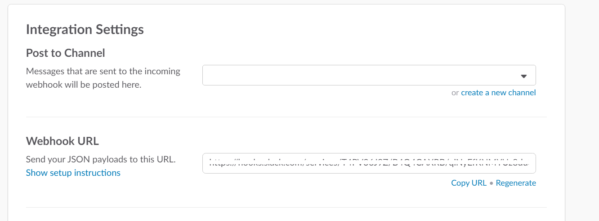
- Redmine의 관리 - 플러그인에서 Redmine slack 플러그인의 설정 클릭
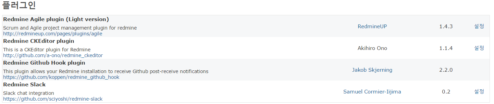
- Slack URL 부분에 위에서 획득한 URL 입력 및, Slack에서 사용할 user name 입력
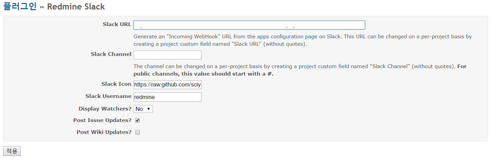
- Redmine의 관리 - 사용자 정의항목 - 새 사용자 정의 항목 - 프로젝트 선택  
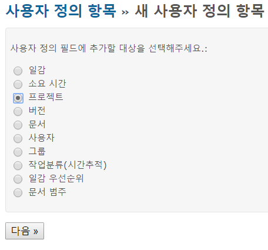
- 형식을 목록으로 선택 한 후, 가능한 값들에 사용할 채널 목록들을 입력
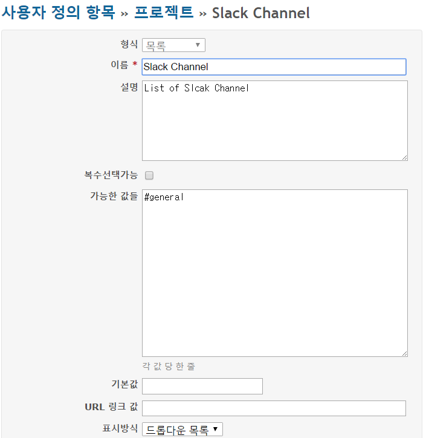
- Slack과 연동할 프로젝트의 설정 - 정보 부분에서 사용할 채널 선택  
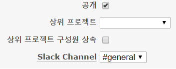
- 프로젝트의 일감 변동이 있을시, 해당 Slack 채널에서 확인 가능
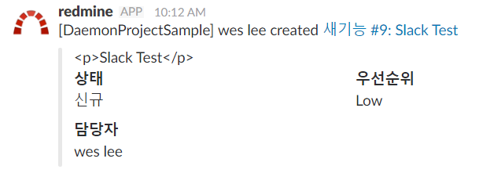

4. Github hook
- Redmine과 Github(Git bucket도 가능)을 연동하여, 등록된 git을 통해 소스 변경시 hook방식으로 Redmine에 지정된 소스를 갱신 해주는 플러그인
- 등록된 일감과 코드를 comment에 #(일감번호)형식으로 작성 함으로써 연동이 편하도록 함
- Redmine과 Github을 연동 할 경우, Redmine이 설치되어있는 로컬에 Github의 Mirror 저장소를 만든 후, 해당 저장소를 사용 하여야함!
- 하기의 docker-custompoint.sh 파일 준비

<pre><code>
git clone https://github.com/koppen/redmine_github_hook.git /usr/src/redmine/plugins/redmine_github_hook

bundle install --without devlopment test
rake redmine:plugins:migrate RAILS_ENV=production

</code></pre>
- docker-compose up 실행
- Redmine의 관리 - 플러그인에서 정상 설치 확인

- Redmine의 관리 - 설정 - 저장소에서 저장소에 WS관리를 사용을 체크 후, API 키 생성
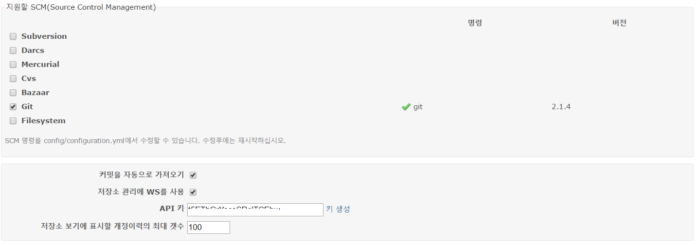
- 연동할 Redmine의 프로젝트의 - 설정 - 저장소에서 Git을 선택후 저장소 추가  
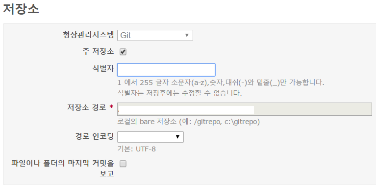
- github(또는 gitbucket)에서 연동할 repositiory(repository명이 redmine의 Project명과 동일 해야함!)의 설정에서 Service - webhook - Add Webhook을 선택  
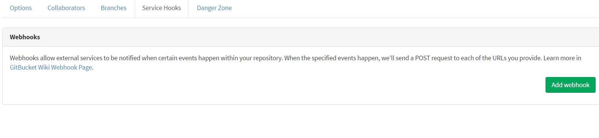
- Payload URL에 [redmine 주소]/github_hook 을 입력 후, Security Token에 위에서 생성한 API키 입력, Trigger로 사용할 이벤트 체크 후 Add webhook 버튼 클릭  
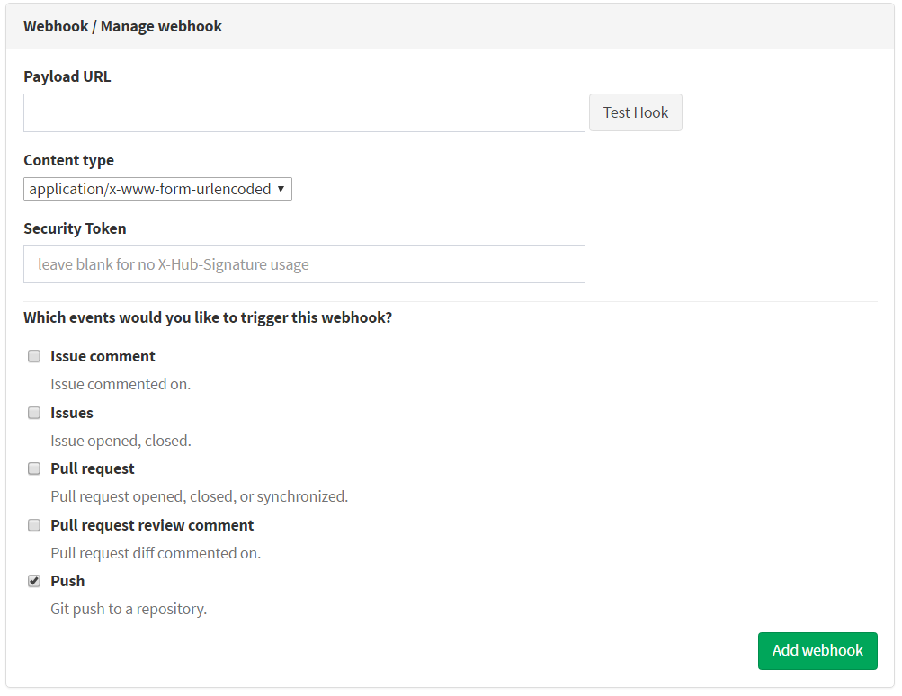

