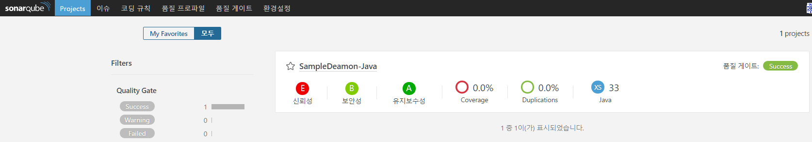

SonarQube
=============


### 개요
코드 품질을 지속적으로 검사할 수 있는 오픈 소스 플랫폼

### 설치 전 필수사항
- 같은 docker network에 mysql 설치

### 설치
- docker-compose.yml
```
version: '2'
services:
 sonarqube:
  restart: always
  image: sonarqube
  container_name: sonarqube
  ports:
  - "590:9000"
  networks:
  - epicurus-net
  environment:
  - SONARQUBE_JDBC_USERNAME=sonarqube
  - SONARQUBE_JDBC_PASSWORD=sonarqube
  - SONARQUBE_JDBC_URL=jdbc:mysql://mysql:3306/sonarqube?useUnicode=true&characterEncoding=utf8&rewriteBatchedStatements=true&useConfigs=maxPerformance&useSSL=false
networks:
 epicurus-net:
  external:
   name: epicurus-net

```
### 테스트
- Plugin 설치
  - http://\<HOST\>:590/sonar
  - Default ID : admin / PW : admin
  - 환경설정 -> 시스템 -> 업테이트 센터, 아래의 플러그인 설치

</br>
- 프로젝트 생성
  - 환경설정 -> 프로젝트 -> management
  - Create Project 클릭
  
  - Name, Key 입력 후 Create 클릭
  
</br>
- gradle에 sonarqube 설정 및 실행
  - build.gradle에 아래 내용 추가
  ```
  /* sonarqube */
  buildscript {
      repositories {
          maven {
              url "https://plugins.gradle.org/m2/"
          }
      }
      dependencies {
          classpath "org.sonarsource.scanner.gradle:sonarqube-gradle-plugin:2.2.1"
      }
  }

  apply plugin: 'org.sonarqube'

  sonarqube {
      properties {
          property "sonar.host.url", "http://<HOST>:590"
          property "sonar.projectName", "SampleDaemon-Java"
          property "sonar.projectKey", "key"
          property "sonar.sources", "src/main"
          property "sonar.tests", "src/test"
          property "sonar.junit.reportsPath", "build/test-results/test"
          property "sonar.sourceEncoding", "UTF-8"
      }
  }
  ```
  - 실행
  ```
  $ gradle sonarqube
  ```
  
